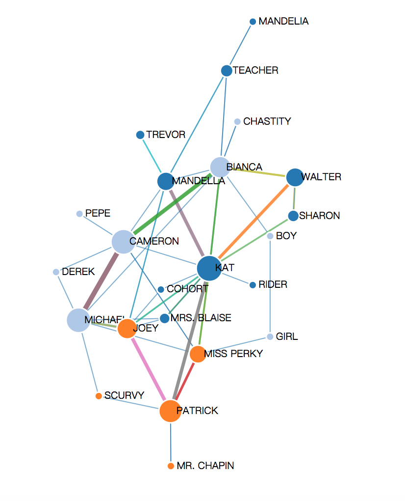
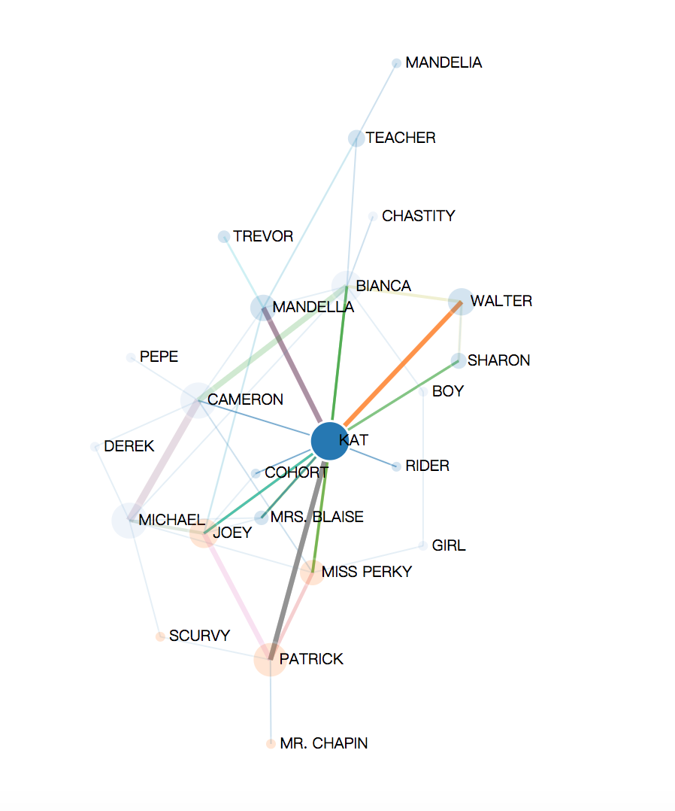
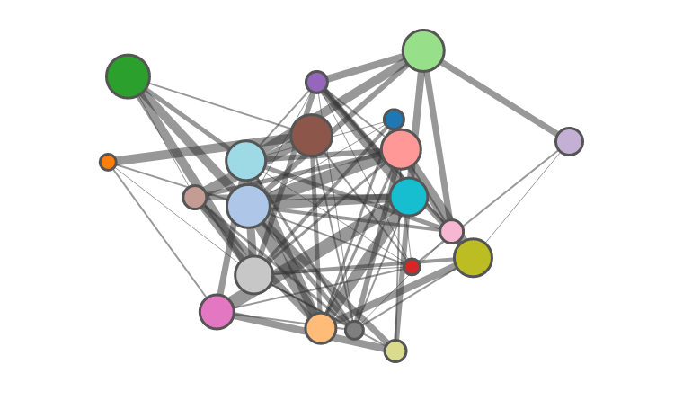
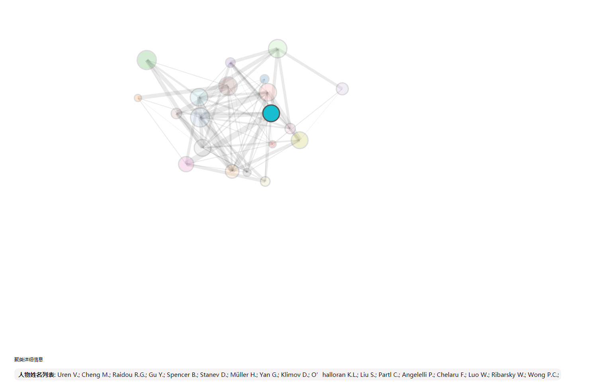
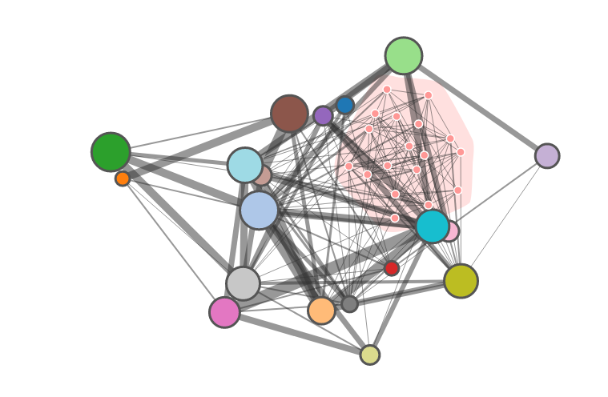
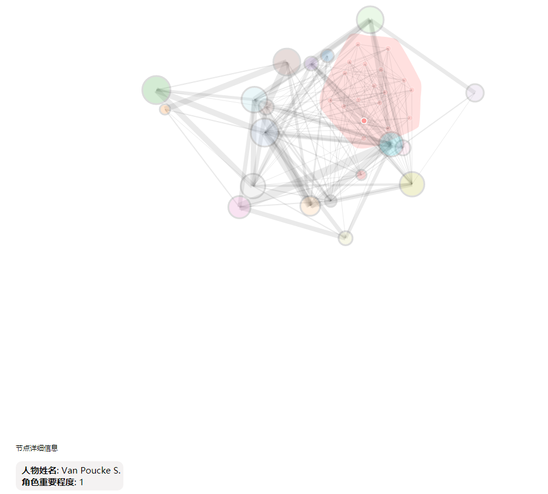

# Course Project: Character Relationship Visualization
Course project for visualization course, 2019 Fall, School of Software, Tsinghua University
## TODO
- 时间轨道
## Message
数据形式重要变更：
- 解析剧本增加：(1) 按每句对话划分nodes和links; (2) 按每一幕划分nodes和links; (3) 在links上存储所有dialogs
- 新的json文件是`jsons/10things_dialogs_scenes_all.json`，第一级含有3个key，分别是`dialogs`, `scenes`, `all`，对应按对话的划分，按幕划分，以及整个剧本
- `dialogs`键对应的值是一个列表，列表中的每个元素是一个dict, dict的3个键值对`source`, `target`, `dialog`分别表示说话的人，说话的人想要说给ta听的那个人，还有说话的人说的话
- `scenes`键对应的值是一个list，list中每个元素是一个dict, dict的2个键值对`nodes`, `links`分别表示该幕所有node（一个dict表示一个node，`id`键值对表示节点人物名字，`group`键值对表示节点的度）以及该幕所有的link（一个dict表示一个link，`source`和`target`键值对分别表示link的两个节点的`id`，`dialogs`键值对表示`source`和`target`的所有对话`，`value`键值对表示对话的条数）
- `all`键对应的是一个dict，其中2个键值对`nodes`和`links`分别表示整个剧本中所有的node和link，node, link的dict表示方式与`scenes`中相同
## Project Structure
- `backend:` movie script parser and optional project backend
    - `LPA.py`: LPA clustering 
    - `parse.py`: movie script parser to json
- `imgs`: for image storage
- `jsons`: parsed json file from movie script
- `movie_scripts`: raw movie scripts in text
- `bundling.html`: large graph with node aggregation & edge bundling
- `d3.v4.min.js`: d3 source file
- `index.html`: detailed graph with attention
- `server.sh`: server launcher script
## Visualization
- LPA clustering

- Attention highlight

- Node aggregation & edge bundling

