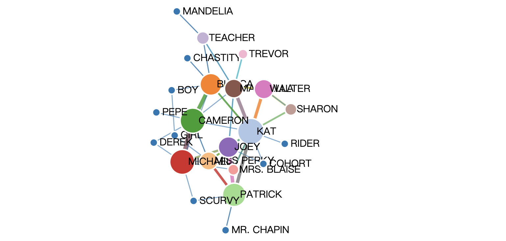

# Course Project: Character Relationship Visualization

## TODO
- 人物名字遮挡问题
- 对白情感倾向性分析，link颜色
- 分scene动画，时间轴
- 其他交互功能
## Project Structure
- backend: movie script parser and optional project backend
    - parse.py: movie script parser to json
- imgs: for image storage
- jsons: parsed json file from movie script
- movie_scripts: raw movie scripts in text
- d3.v4.min.js: d3 source file
- index.html